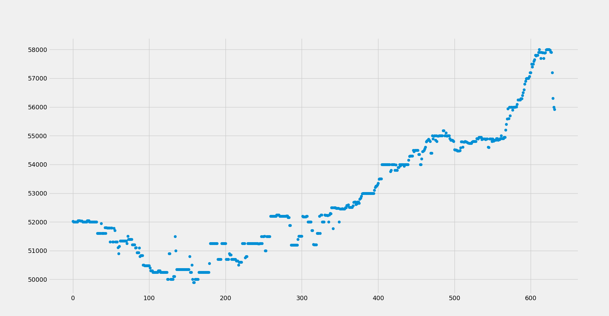

# BitcoinBot

Check **FOXBIT API** for bitcoin price

check every 1 minute for changes in BTC price at FOXBIT plataform

**Email send**

Also send email every 1 hour with the log.

You have to add your email at the command line:

    python3 consult.py <youremail@serv.com>
    
if none email is passed, defautl email send is to 
mine email and felix's email

# Dependencies

    sudo pip3 install requests, numpy, matplotlib

# Running bot

    python3 consult.py <youremail@serv.com>

# Data Visualization / prediction

    cd data/
    
    python3 mining.py
